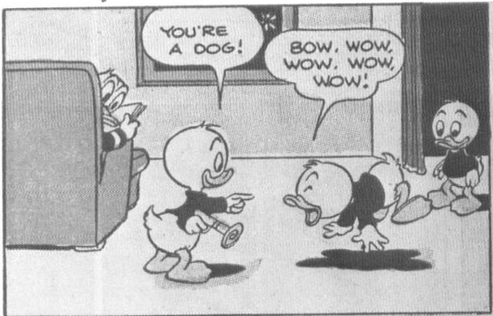
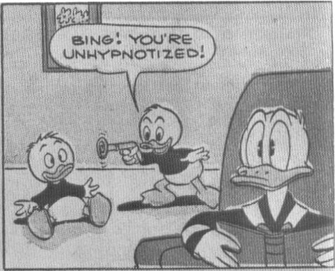
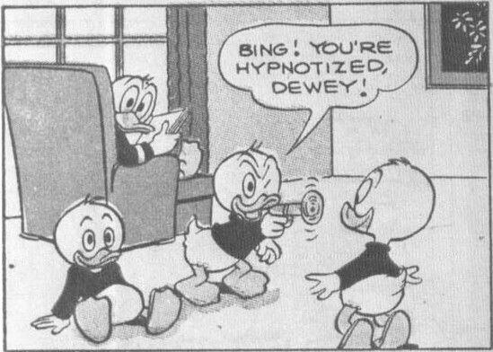
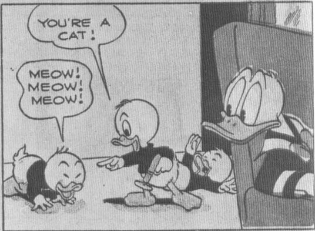
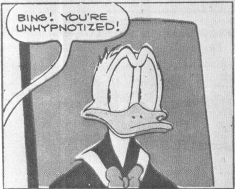
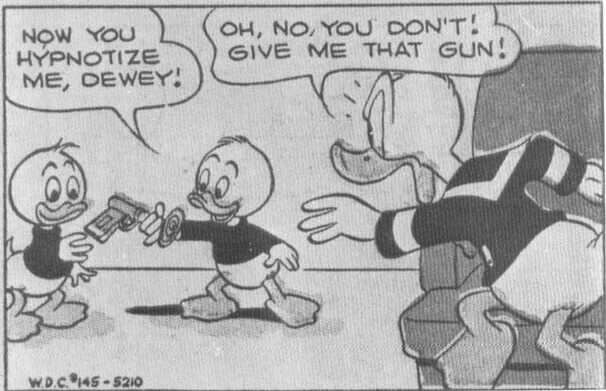

From *Walt Disney's Comics* No. 145, October 1952; © 1952 Walt Disney Productions.

intractable deadbeat, Rockjaw Bumrisk. Donald tries to hypnotize Bumrisk with no success, and finally Rockjaw turns the gun on Donald. Once again Donald goes under—first as a gopher ("Cherk! Cherk! I keep thinking

that I have to collect a dollar from this guy! But how can I when I'm only a gopher?"), then a chicken. Then Bumrisk hypnotizes Donald into thinking that he's a gorilla. This is a mistake. Donald is a bill-collecting gorilla,