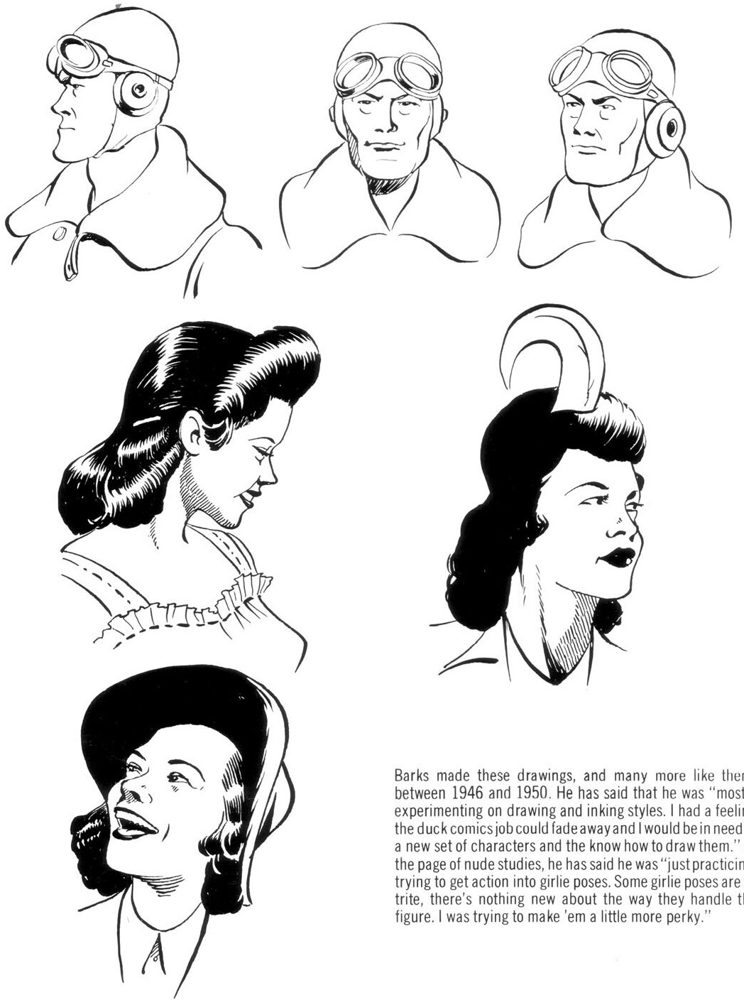

Barks made these drawings, and many more like them, between 1946 and 1950. He has said that he was "mostly experimenting on drawing and inking styles. I had a feeling the duck comics job could fade away and I would be in need of a new set of characters and the know how to draw them." Of the page of nude studies, he has said he was "just practicing, trying to get action into girlie poses. Some girlie poses are so trite, there's nothing new about the way they handle the figure. I was trying to make 'em a little more perky."