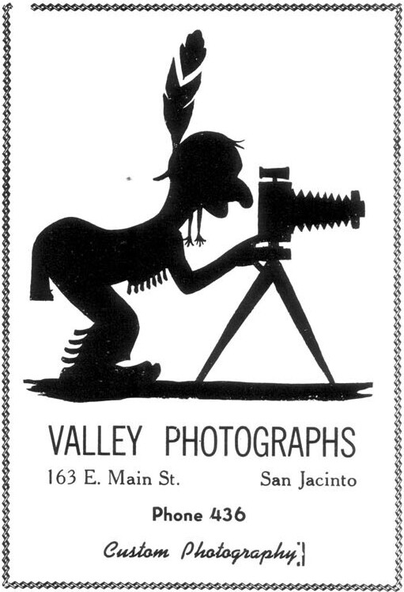

After Barks had moved to San Jacinto and was working on comic books, he did very little outside work, except for friends in the San Jacinto-Hemet area. He did cartoons pushing a water-bond drive in 1952, and advertising art for local businessmen. He was hired in 1949 or 1950 to draw several political cartoons by a former resident of Hemet who was embroiled with the mayor of Palos Verdes, California, in a dispute over the legality of landing helicopters in the city. In the cartoons, the mayor was depicted as a top-hatted billy goat, standing in the way of progress.

