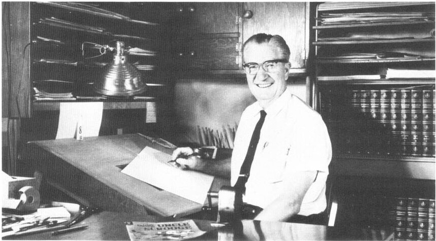

**CALIFORNIA OFFICE—SEATED, L. TO R.:** *Michael H. Arens, Carl Buettner, J. Alfred Riley, Jane Werner Watson, Alice N. Cobb, Albert L. Stoffel, Thomas McKimson.*
**STANDING, L. TO R.:** *Ralph Heimdahl, Chase Craig, Francis J. Hoffman, A. L. Zerbe, John N. Carey, Guy Erne, Carl Barks, R. S. Callender.*

This photograph of Carl Barks and other members of Western Publishing's California staff appeared in the company's annual report for 1957. Of the other people in the photo, R.S. Callender was a vice president of Western and head of its West Coast Division; Albert L. Stoffel was Callender's assistant; Chase Craig and Alice N. Cobb were comic-book editors; Thomas McKimson supervised the Whitman books; Carl Buettner supervised the Golden Books; Michael H. Arens and John N. Carey were comic-book artists; and Ralph Heimdahl was the artist for the Bugs Bunny newspaper strip. Most of the other people in the photo were members of the sales staff.

Barks at his drawing board; this photo was probably taken late in 1962.