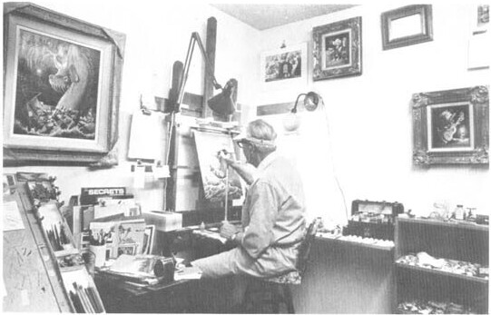
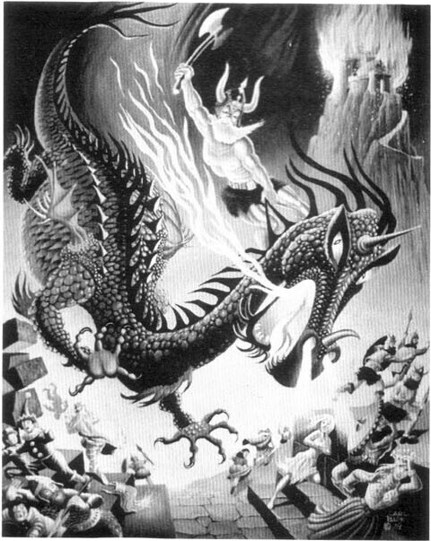
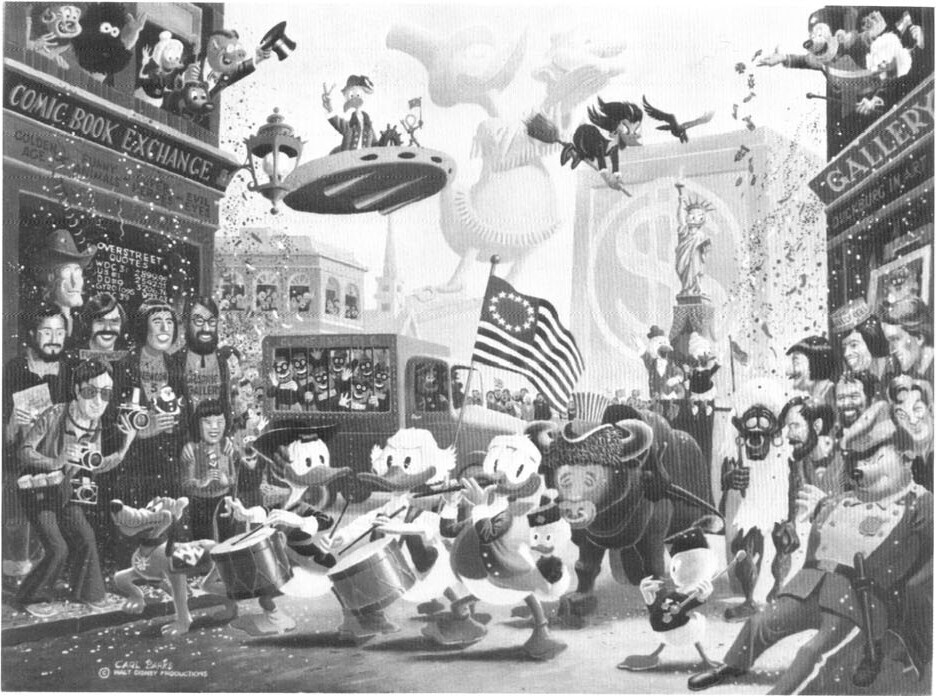

Carl Barks at work on a duck painting in 1974.

Barks's final painting on a Disney subject was "July Fourth in Duckburg" (24 x 16, oil on masonite). Since permission for the Disney paintings was withdrawn in 1976, Barks has concentrated on fantasy subjects of his own choosing, such as "King Beowulf" (20 x 16, oil on masonite). Bicentennial painting ©Walt Disney Productions; "King Beowulf" ©1978 Carl Barks.

