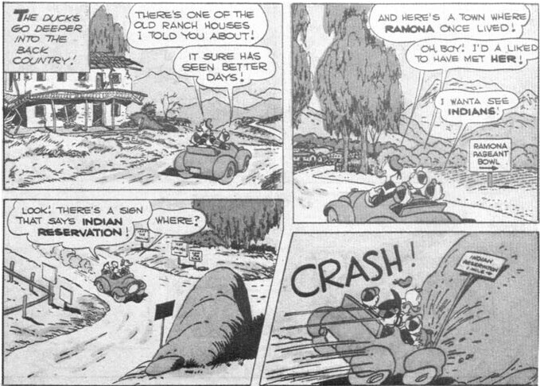

DONALD DUCK in "The Magic Hourglass" - 28 - Scrooge gives the nephews an hourglass that he later discovers is the source of his great wealth. Carrying a billion dollars to buy the hourglass back, he follows the ducks to Africa, where they have gone to fill the hourglass with fresh sand from the oasis of No Issa — the only kind of sand that will keep perfect time in the hourglass and so make its owner richer by the hour. (*Mar. 16, 1950*)

## Four Color 300 - (November) 1950 - 52 pages
## Donald Duck in Big-top Bedlam

DONALD DUCK in "Big-top Bedlam" - 28 - Donald loses Daisy's heirloom brooch on the way to hock it for enough money to buy circus tickets for him and the nephews. The brooch turns up mysteriously in the hands of a quick-change artist at the circus, and Donald gets a job as a clown so that he can try to get the brooch back. (*Apr. 20, 1950*)

## Four Color 308 - (January) 1951 - 52 pages
## Donald Duck in Dangerous Disguise

DONALD DUCK in "Dangerous Disguise" - 28 - The ducks intercept a message to Madame Triple-X, a beautiful spy, and try to beat her to Chiliburgeria, where she is to deliver the plans for a stolen American bomb to another secret agent. In Chiliburgeria, after a hectic train ride Donald impersonates the other agent, a bullfighter named Donaldo el Quacko. (*June 29, 1950*)

Most of the characters in this story are humans, rather than humanoid dogs; Barks had used human characters in earlier stories, but never so prominently as in this one, and Western's editors did not approve. "As soon as I took 'Dangerous Disguise' in, and Carl Buettner [Western's art editor] took a look at it, he said, 'That doesn't go good, having real humans.' It takes the ducks out of their own world." (1971 interview)

## Four Color 318 - (March) 1951 - 52 pages
## Donald Duck in No Such Varmint

DONALD DUCK in "No Such Varmint" - 28 - An aptitude test says that Donald should be a great detective, and so he is hired to investigate the mysterious sinking of one of Uncle Scrooge's gold ships. Donald's true aptitude is that of a snake charmer, though, and his playing so charms a huge sea serpent that he has to keep playing for days. (*July 27, 1950*)

Reprinted: *Walt Disney Comics Digest* No. 34, April 1972.

## Four Color 328 - (May) 1951 - 36 pages
## Donald Duck in Old California

DONALD DUCK in Old California! - 28 - The ducks, injured in a car wreck in Southern California, are transported by means of a mysterious dream to the California of 1848. While there, they stay at the home of a wealthy Spanish rancher, take part in the gold rush, and help a young vaquero win the hand of a rancher's daughter. (*Nov. 2, 1950*)

This story is set in that section of Southern California in which Barks himself lived at the time. However, few of the settings were taken from life. He has said this about the settings for his stories, and "In Old California" in particular: "No settings are taken from life. But the type of houses and terrain are recognizably local. I sometimes used 'memory pictures' of places I've seen as background locale. Notably Puget Sound, and the local deserts." (June 1968 letter to Michael Barrier)

However, he said in the 1974 interview, "I was laying it right around San Jacinto there, where I lived. Now, this rock [the one the ducks' car runs into, on the third page], that was just a couple of miles from where we lived. There's a Soboba Indian reservation out there, and a road came across from San Jacinto, across a river and up here [to the rock], where it turned to go down to the Indian reservation. There were some rocks up there on the side of the hill — they weren't exactly like that [like the one in the story], they were covered with sagebrush — and the Duck could very easily have made a miscue and run his car into one of those rocks."

From *Donald Duck* Four Color No. 328, 1951; © 1951 Walt Disney Productions.