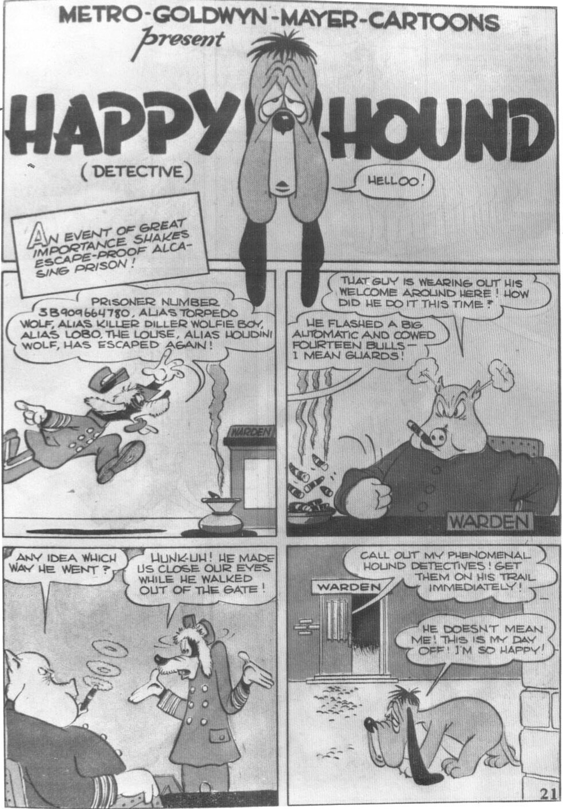
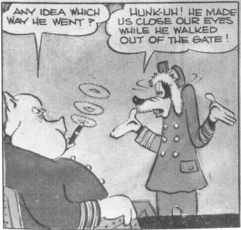
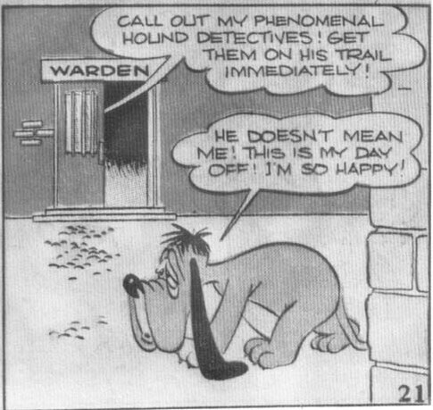

# HAPPY HOUND
## (DETECTIVE)

**Happy Hound:** HELLOO!

**Narrator Box:** AN EVENT OF GREAT IMPORTANCE SHAKES ESCAPE-PROOF ALCASING PRISON!

**Warden (Pig):** THAT GUY IS WEARING OUT HIS WELCOME AROUND HERE! HOW DID HE DO IT THIS TIME?

**Radio/Intercom:** PRISONER NUMBER 3B909664780, ALIAS TORPEDO WOLF, ALIAS KILLER DILLER WOLFIE BOY, ALIAS LOBO THE LOUSE, ALIAS HOUDINI WOLF, HAS ESCAPED AGAIN!

**Guard:** HE FLASHED A BIG AUTOMATIC AND COWED FOURTEEN BULLS— I MEAN GUARDS!

**Warden:** ANY IDEA WHICH WAY HE WENT?

**Wolf Guard:** HUNK-UH! HE MADE US CLOSE OUR EYES WHILE HE WALKED OUT OF THE GATE!

**Warden:** CALL OUT MY PHENOMENAL HOUND DETECTIVES! GET THEM ON HIS TRAIL IMMEDIATELY!

**Happy Hound:** HE DOESN'T MEAN ME! THIS IS MY DAY OFF! I'M SO HAPPY!

21

From *Our Gang Comics* No. 9, Jan.-Feb. 1943; © 1943 Loew's Inc.