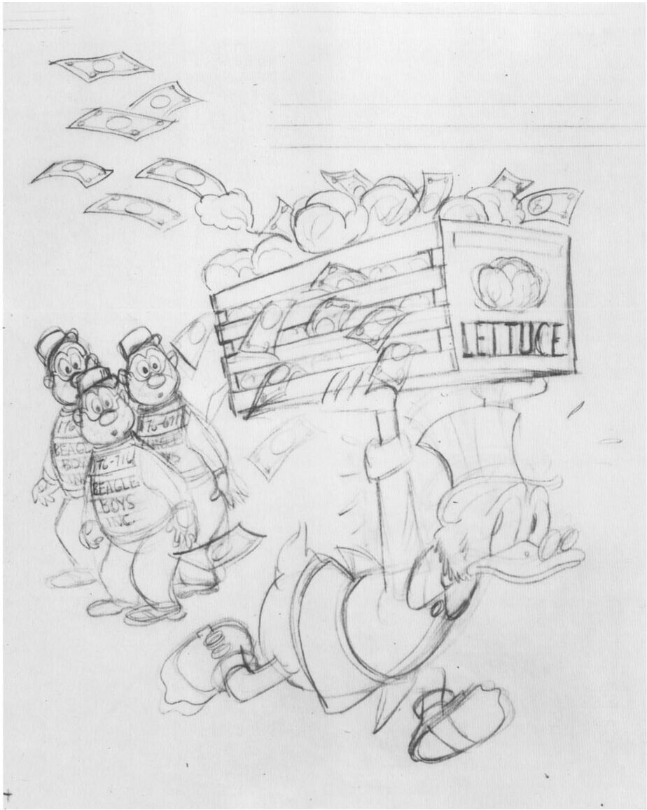

persuaded by Scalpnick's story that the crash gave him an allergy to wigs, awards him nine hundred times more money than there is in the world. (*Feb. 19, 1964*)

*Reprinted: Uncle Scrooge* No. 85, February, 1970; No. 152, May 1978.

**53 - October 1964 - 36 pages**

Front cover. A nervous Scrooge, wearing a postman's hat, prepares to deposit a letter in the mouth of a strange, living mailbox. (Illustrating "Interplanetary Postman.") (*Mar. 27, 1964*)

*Reprinted: Uncle Scrooge* No. 94, August 1971; No. 154, July 1978.

Barks's blue-pencil rough for the front cover of *Uncle Scrooge* No. 51, August 1964; © 1964 Walt Disney Productions.