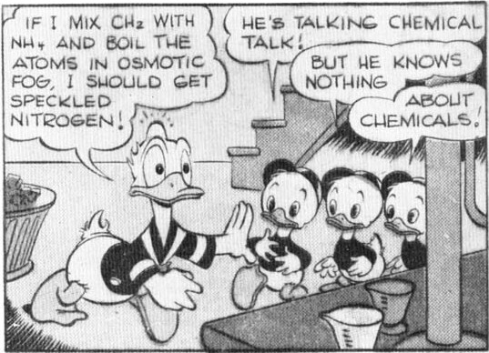
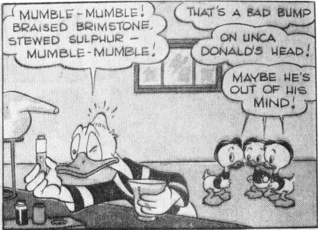
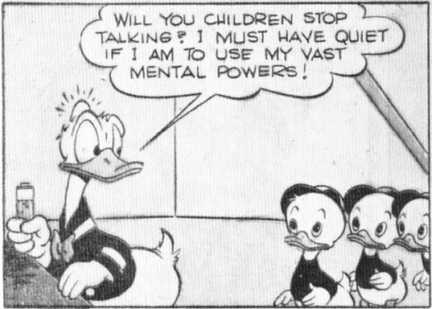

agency and trap a bank robber despite Donald's efforts to confuse them with phony clues. *(May 31, 1945)*

These pages have nine to eleven panels each; most have ten.

## 62 (6/2) - November 1945 - 52 pages

DONALD DUCK - 10 - Donald enters water-ski races and has to operate his tow boat by remote control when the nephews eat themselves sick on popcorn and candy. *(June 27, 1945)*

**Cross-references:** At the beginning of this story, Donald refers clearly to the story in the preceding issue, Walt Disney's Comics No. 61, October 1945.

## 63 (6/3) - December 1945 - 52 pages

DONALD DUCK - 10 - Donald advertises to find the rightful owner of a ten-dollar bill the nephews have found, and he is besieged by phony claimants. *(Aug. 2, 1945)*

**Changes:** According to Barks, the ducks' halos in the last panel were added by the editors. (April 1968 letter to Michael Barrier)
**Reprinted:** Walt Disney's Comics No. 304, January 1966

## 64 (6/4) - January 1946 - 52 pages

DONALD DUCK - 10 - Donald resolves not to lose his
temper and the nephews run wild, finally digging into Donald's old love letters. *(Sept. 19, 1945)*

First appearance of Daisy Duck in a Barks story.

## 65 (6/5) - February 1946 - 52 pages

DONALD DUCK - 10 - The nephews obtain a parrot at the docks — "a guy named Joe from Singapore" — and then try to persuade Donald to let them keep it. *(Oct. 4, 1945)*
**Reprinted:** Walt Disney's Comics No. 420, September 1975.

## 66 (6/6) - March 1946 - 52 pages

DONALD DUCK - 10 - Donald goes ice-fishing, but spends more time under the ice than on it as he battles a big, wily old fish. *(Oct. 27, 1945)*

## 67 (6/7) - April 1946 - 52 pages

DONALD DUCK - 10 - The nephews buy miniature jet engines with their savings, against Donald's wishes, but the engines save Donald's life when he and a girl are trapped on a peak. *(Nov. 23, 1945)*

## 68 (6/8) - May 1946 - 52 pages

DONALD DUCK - 10 - Donald builds a huge kite to