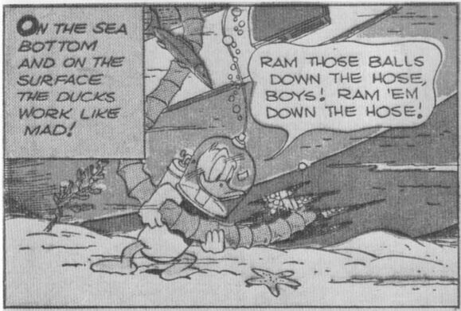
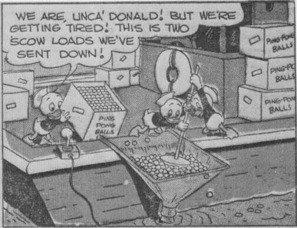
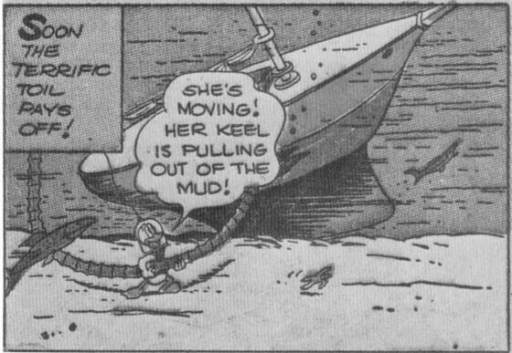
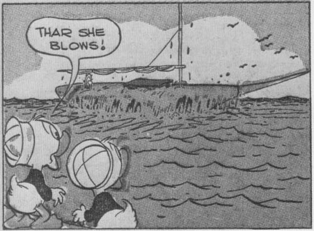

From *Walt Disney's Comics* No. 104, May 1949; © 1949 Walt Disney Productions.

houseboat on Lake Erie for the summer to keep them out of mischief. (Jan. 10, 1952)

Reprinted: *Walt Disney's Comics* No. 370, July 1971.

## 143 (12/11) - August 1952 - 52 pages

Front cover (art only): The nephews menace Donald in the water with a phony shark fin. (Jan. 3, 1952)

DONALD DUCK - 10 - Donald and the nephews hunt gemstones in the desert, trying to match Gladstone's luck at finding jewels. (Jan. 10, 1952)

Barks has said that this story "was inspired by the desert which is just over a range of hills from San Jacinto. I've sweated through heat waves and wind storms generated by that desert so many years it is no longer fun." (Oct. 14, 1969, letter to Winston Ljungdahl)

Reprinted: *Walt Disney's Comics* No. 369, June 1971.

## 144 (12/12) - September 1952 - 52 pages

Front cover (art only): Donald is caught by his shirt when he pole vaults. (Jan. 3, 1952)

DONALD DUCK - 10 - The ducks travel the country spending extravagantly to get rid of money that Uncle Scrooge's vaults cannot hold. (Feb. 21, 1952)

Barks: "Slated for #145 W.D.C. but used in #144." The story

originally scheduled for No. 144 was shelved (see "Unpublished and Unidentified Material").

Reprinted: *Walt Disney's Comics* No. 343, April 1969.

## 145 (13/1) - October 1952 - 52 pages

Front cover (art only): The nephews jump rope with frankfurters. (Jan. 3, 1952)

DONALD DUCK - 10 - Donald believes that the nephews' toy gun actually has the power to hypnotize, and he tries it out on Uncle Scrooge. (Mar. 6, 1952)

Reprinted: *Walt Disney's Comics* No. 357, June 1970.

## 146 (13/2) - November 1952 - 52 pages

Front cover (art only): Donald rolls the nephews dry in a towel. (Jan. 3, 1952)

DONALD DUCK - 10 - Donald's attempt to raise chickens on the heights overlooking the town of Pleasant Valley leads to a series of calamities culminating in the town's being renamed "Omelet." (May 15, 1952)

Reprinted: *Walt Disney's Comics* No. 358, July 1970.

## 147 (13/3) - December 1952 - 52 pages

Front cover (art only): The nephews construct an Erector-set ladder to a cookie jar. (July 31, 1952)