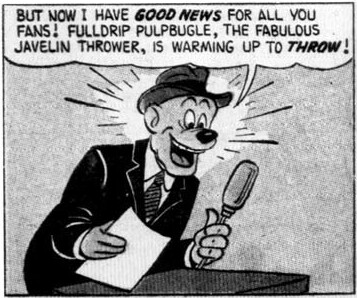
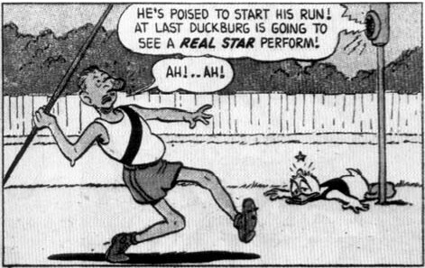
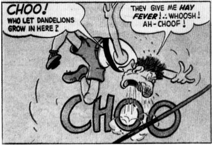
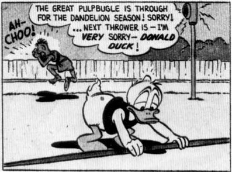

From *Walt Disney's Comics* No. 188, May 1956; © 1956 Walt Disney Productions.

DONALD DUCK - 10 - Donald attends a "suppressed desire" party dressed as a knight in shining armor, and the other partygoers scoff at him. *(Mar. 15, 1956)*

Barks: "I bought the basic idea for this story from my daughter who lived in Washington state."

A bus' destination is identified as "Hemet," a California town near San Jacinto, where Barks lived at the time.

Reprinted: *Donald Duck* No. 135, January 1971.

## 199 (17/7) - April 1957 - 36 pages

Front cover (art only): The nephews get paint all over themselves and none on the canvas. *(Sept. 6, 1956)*

DONALD DUCK - 10 - Gyro invents a machine that lets the ducks see greatly magnified versions of everyday life. *(Sept. 20, 1956)*

Reprinted: *Walt Disney's Comics* No. 434, November 1976.

## 200 (17/8) - May 1957 - 36 pages

Front cover (art only): The nephews startle Donald with a frog under a top hat. *(Nov. 29, 1956)*

Barks's list shows that an idea for a front cover identified as "Donald Duck 'Frog in Hat'" was accepted by Western on September 17, 1953, and the drawing for that cover was accepted on October 8, 1953. That drawing was apparently never published.

DONALD DUCK - 10 - Donald starts a pet service to feed pets whose owners are on vacation, and some of the pets are highly unusual. *(Apr. 5, 1956)*

Barks: "Got basic idea of this from my daughter."

Reprinted: *Walt Disney's Comics* No. 360, September 1970.

## 201 (17/9) - June 1957 - 36 pages

DONALD DUCK - 10 - Donald mistakenly dumps a powerful dye invented by Gyro in the city reservoir, dying much of the city red. *(July 5, 1956)*

Reprinted: *Walt Disney's Comics* No. 435, December 1976.

## 202 (17/10) - July 1957 - 36 pages

DONALD DUCK - 10 - Donald and Scrooge go to an Indian reservation to learn the medicine man's secret of making rain. *(May 31, 1956)*

Reprinted: *Walt Disney's Comics* No. 381, June 1972.

## 203 (17/11) - August 1957 - 36 pages

DONALD DUCK - 10 - The nephews are hired to deliver a package within twenty minutes, but a lion blocks their way. *(Oct. 11, 1956)*

Reprinted: *Walt Disney's Comics* No. 374, November 1971.

## 204 (17/12) - September 1957 - 36 pages

Front cover: The nephews try to play checkers with Mexican jumping beans. *(Jan. 25, 1957)*

DONALD DUCK - 10 - Donald and the nephews, as park workers, try to clean the sculptured head of Senator Snoggin that is carved into a mountainside. *(June 21, 1956)*

## 205 (18/1) - October 1957 - 36 pages

DONALD DUCK - 10 - Donald tries to raise a prime crop of apples, but his efforts benefit only Gladstone's tree. *(Sept. 25, 1956)*

Reprinted: *Walt Disney's Comics* No. 387, December 1972.