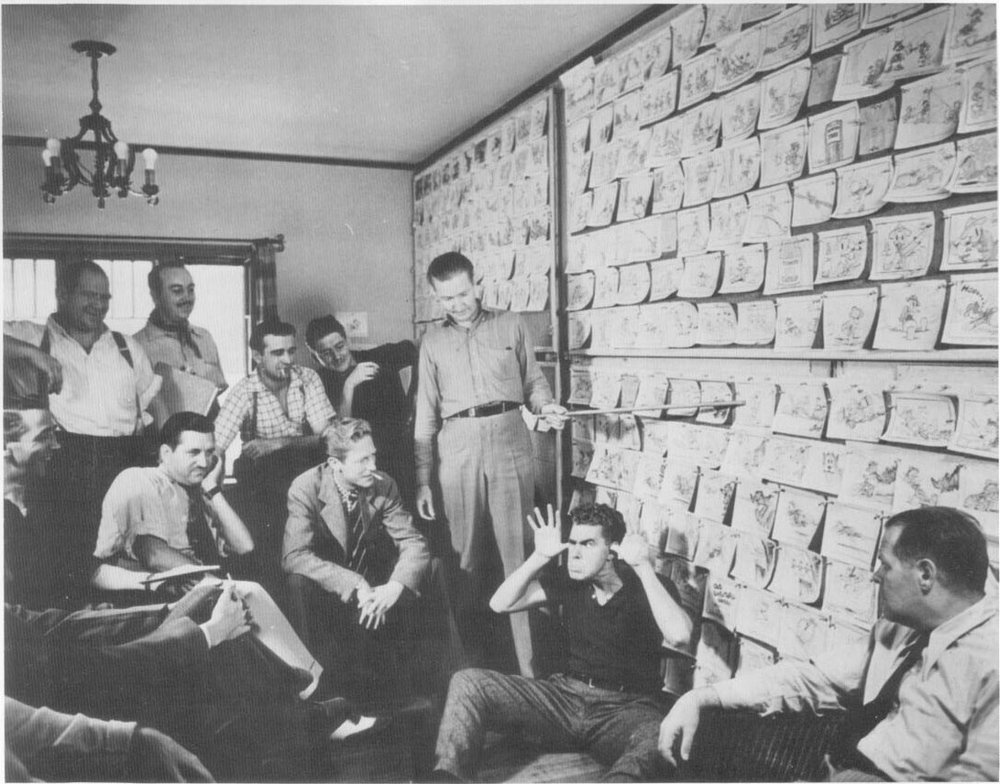

Barks holds a pointer on the storyboard for *Good Scouts* while Harry Reeves sits on the floor and makes faces in this 1937 publicity photo (taken on the same day as the photo on page 17). Among others in the photo are, standing left to right, Roy Williams, T. Hee, and Ed Penner; Peter O'Crotty is seated next to Barks. © 1937 Walt Disney Productions