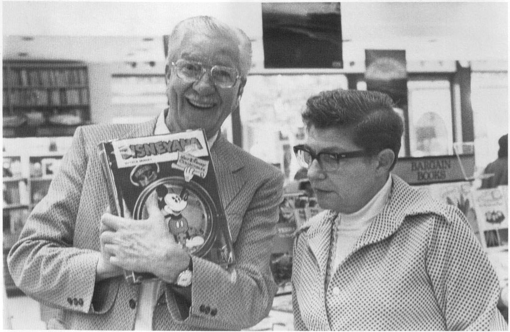

Illustrated No. 2) include interesting observations on comic-book technique, or on Barks's own work.

Barks has done many sketches for fans, and a few

of those have turned up in fan magazines; but I am not going to try to list them. This has got to stop someplace.

Barks and his wife were photographed with *Disneyana*—the first of the Disney studio's own publications to acknowledge Barks's importance—at the 1976 Newcon comics convention in Boston.